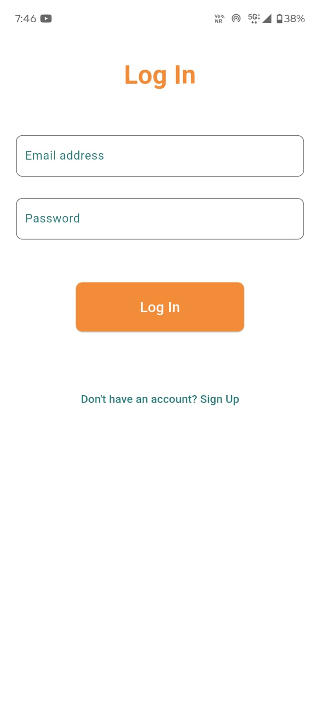
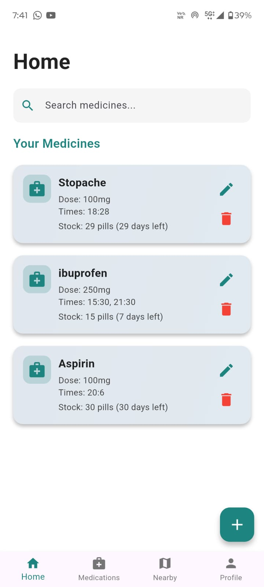
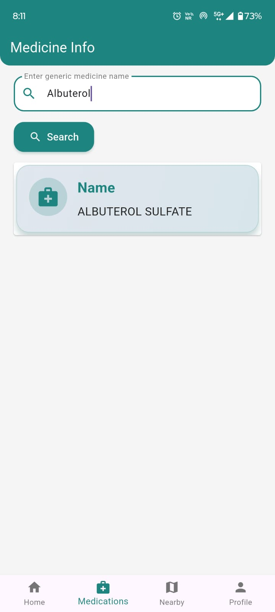
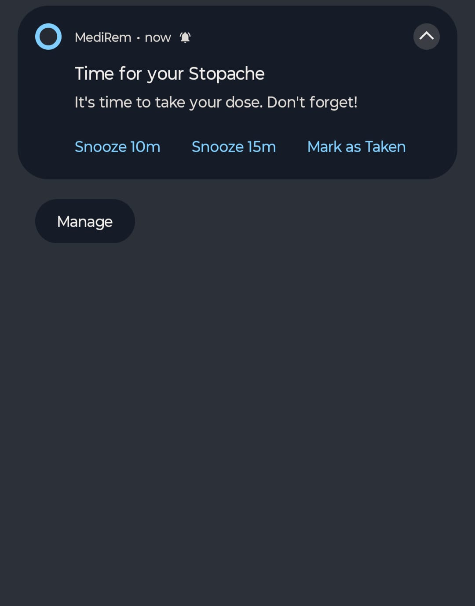
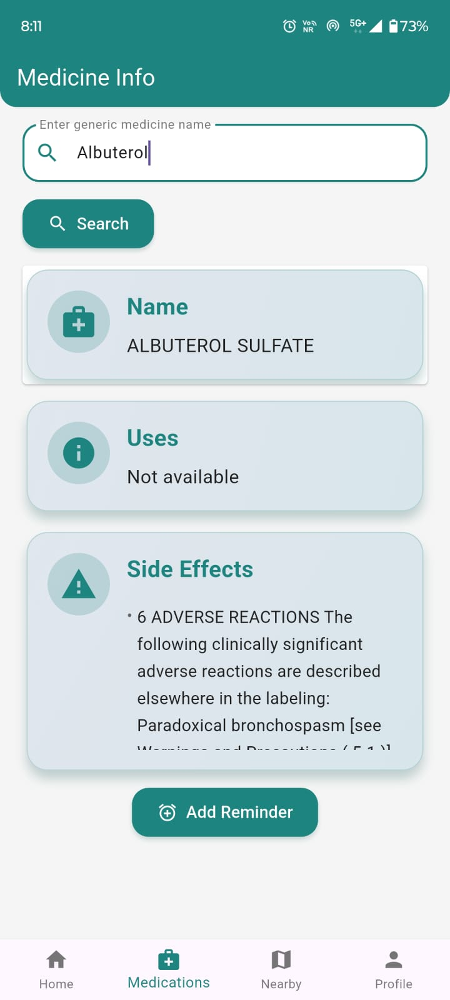
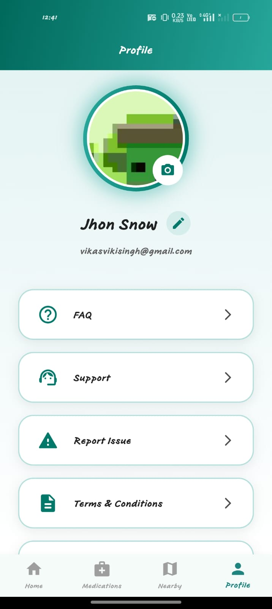

# MediRem 💊

**MediRem** is a smart medicine reminder mobile application built to help users stay consistent with their medications, track stock levels, and quickly find nearby pharmacies — all through a clean, user-friendly interface.

---

## 🚀 Why MediRem?

In day-to-day life, people often forget to take medicines, lose track of remaining stock, or don’t know where to find nearby pharmacies when needed. **MediRem** brings all these essentials together by combining reminders, medicine tracking, verified medical information, and map-based discovery in one place.

---

## 📱 App Screenshots

> A visual walkthrough of MediRem, from onboarding to daily usage.

### 🚀 Onboarding Flow

  
  
  

### 🏠 Core App Experience

  
  
  

  
  
  

### 📘 Information & Location

  
  
  

---

## ✨ Features

### 🏠 Home Dashboard

* Overview of all active medicines
* Displays remaining stock and estimated days left
* Quick actions to add, edit, or delete medicines

### ➕ Add / Update Medicine

* Simple, step-by-step medicine entry
* Dosage and daily schedule configuration
* Automatic duration calculation based on stock

### ⏰ Smart Reminders

* Timely notifications for each scheduled dose
* Snooze reminders or mark medicine as taken
* Supports multiple doses per day

### 📉 Stock Management

* Automatically updates stock after each dose
* Low-stock alerts before medicines run out

### 📘 Medicine Information

* Fetches real-time data using **OpenFDA API**
* Displays medicine uses and possible side effects

### 🗺️ Nearby Pharmacies

* Location-based pharmacy discovery
* Interactive maps powered by **OpenStreetMap (OSM)**

---

## 🛠 Tech Stack

* **Flutter** – Cross-platform mobile development
* **Firebase** – Database, notifications, backend services
* **OpenFDA API** – Trusted medicine information
* **OpenStreetMap (OSM)** – Maps and location services

---

## 📌 Project Highlights

* Real-world healthcare use case
* Clean and modern UI design
* Practical business logic beyond basic CRUD
* Integration of APIs, maps, and notifications

---

## 🔮 Future Improvements

* Doctor or prescription upload
* Multi-language support

---

## 📣 Feedback

Feedback and suggestions are always welcome. Feel free to open an issue or reach out!

---

⭐ If you like this project, consider giving it a star!
